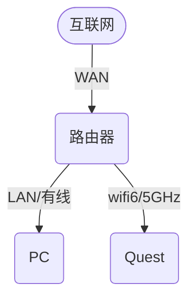

# 优化无线串流

## 调整串流参数

- 降低串流的比特率，这可以降低带宽占用以及延迟。

## 网络拓扑指南

此处列举一些常见的串流网络环境。

### 拓扑1：常规拓扑

这是首选拓扑，即最常见的家用网络环境。建议使用有线网络连接PC以避免干扰。

### 拓扑2：电脑热点

建议PC使用有线连接互联网以避免干扰。此方法通过TUN代理软件还能让Quest具有全局代理。

### 拓扑3：手机热点

不建议。

串流不会消耗手机流量，但可能造成手机的流量统计异常。

### 拓扑4：无线网络提供商

不建议。由于网络提供商提供的无线网络质量水平不一，还具有限速/隔离等设置，可能无法连接串流、体验不佳。

